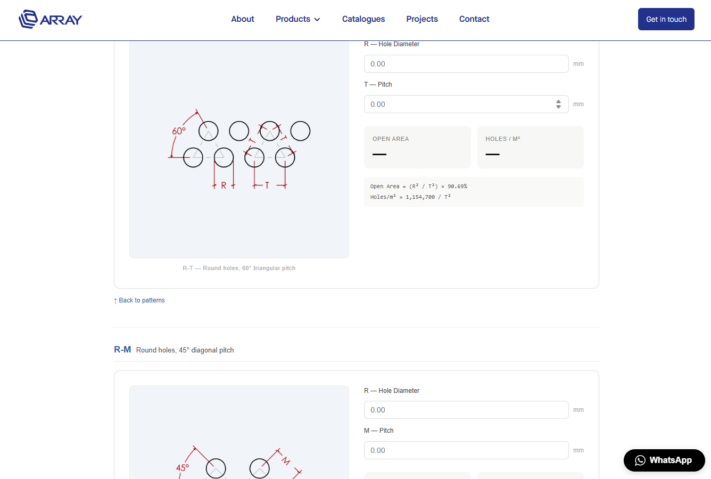

# Perforated Metal Open Area Calculator

A self-contained calculator widget for perforated metal sheets, embedded in [arraymetal.com](https://arraymetal.com/open-area-calculator). Users select a perforation pattern, enter hole dimensions, and instantly get the open area percentage and hole density (holes/m²).

**Live site:** https://arraymetal.com/open-area-calculator



---

## What This Is

The calculator supports 9 perforation patterns across four hole shapes (Round, Oblong, Square, Hexagon). All logic is in a single self-contained embed file — no external dependencies, no build step. It includes a modal inquiry form that pre-fills with the selected pattern and calculated results, submitting through Webflow's native form pipeline.

---

## How to Use the Embed

The entire calculator is a single file: [`embed/calculator-embed.txt`](embed/calculator-embed.txt)

To deploy on Webflow:
1. Open Webflow Designer → target page → Page Settings → **Custom Code**
2. Paste the full contents of `calculator-embed.txt` into **Before `</body>` tag**
3. Save → Publish

The embed creates its own mount point (`<div id="oa-top">`) and is fully scoped with `oa-` CSS prefixes to avoid conflicts with Webflow styles.

---

## Perforation Patterns

| JS Key | Pattern Name | Hole Shape | Pitch Type |
|--------|-------------|------------|------------|
| RT | R-T | Round | 60° triangular |
| RM | R-M | Round | 45° diagonal |
| RU | R-U | Round | 90° rectangular |
| LRU | LR-U | Oblong | Rectangular |
| LRZ | LR-Z×Z | Oblong | Staggered |
| CT | C-T | Square | 60° triangular |
| CU | C-U | Square | 90° rectangular |
| CDM | CD-M | Square (diagonal) | 45° pitch |
| HT | H-T | Hexagon | 60° triangular |

---

## Architecture

See [`docs/architecture-v3.md`](docs/architecture-v3.md) for a full breakdown.

In brief: the embed is a single IIFE containing all CSS, HTML, and JavaScript. Key structures:
- `PATTERNS` — one entry per pattern with field definitions and open area formula
- `GROUPS` — groups patterns by hole shape for the thumbnail grid
- `IMGS` — CDN URLs for the 9 thumbnail images (hosted on Webflow Assets)
- `calculate(key)` — reads inputs, runs the formula, colour-codes the result (red/orange/green/blue)
- Scroll uses `getBoundingClientRect() + pageYOffset` (not anchor links) to correctly offset for Webflow's sticky 81px navbar

---

## Deployment Script

See [`deploy/README-deploy.md`](deploy/README-deploy.md) for setup instructions.

The scripts in `deploy/` use the Webflow API to upload images and inject the embed automatically. The API token must be provided via the `WEBFLOW_TOKEN` environment variable — never hardcoded in a file.

---

## Version History

| Version | File | Description |
|---------|------|-------------|
| v1 | `preview/archive/calculator-v1.html` | Standalone, base64-encoded images (no CDN dependency) |
| v2 | `archive/embed-v2.txt` | CDN image URLs, no modal |
| v3 | `embed/calculator-embed.txt` | Modal inquiry form, current production |
| v4 | `feature/v4-ghost-form` branch | Ghost form for Webflow CRM integration (in progress) |

---

## Project Structure

```
├── embed/
│   └── calculator-embed.txt    ← production embed (paste into Webflow)
├── deploy/
│   ├── deploy_oa_v3.py         ← Webflow API deployment script
│   ├── deploy_oa_calculator.py ← v2 script (reference)
│   └── README-deploy.md
├── preview/
│   ├── calculator-v3.html      ← standalone v3 preview (open in browser)
│   ├── scroll-test.html        ← isolated scroll behaviour test
│   └── archive/                ← v1 and v2 standalone previews
├── assets/
│   ├── diagrams/               ← 9 full-res pattern PNGs (Webflow CDN source)
│   ├── thumbs/                 ← 9 thumbnail PNGs (used in embed)
│   ├── reference/              ← generic hole-shape reference diagrams
│   └── screenshot.png
├── docs/
│   └── architecture-v3.md     ← detailed technical breakdown
└── archive/                   ← old embed versions (v2, v3 no-modal, partials)
```

---

## License

MIT
