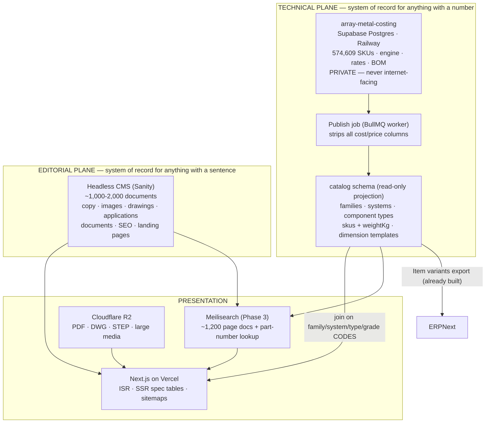
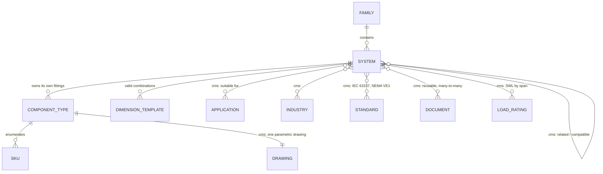
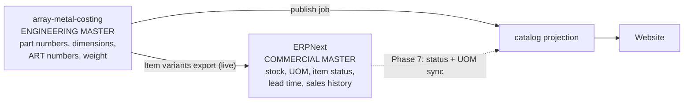

# Array Metal Digital Product Platform — Architecture & Data Model

**Status:** Planning deliverable. No implementation started.
**Date:** 2026-08-10
**Scope:** Corporate website + technical product catalogue + SKU/spec/drawing display + document library, built on top of the existing costing database.

---

## 0. What I inspected, and the numbers that decide the architecture

I inspected the live costing application at `Software Projects/array-metal-costing` (Next.js 14 + Supabase + Railway, deployed at `costing1.arraymetal.com`) and queried its production database read-only.

### 0.1 The single most important fact

```
items                       574,609 rows   (574,605 active)
product_categories               42
distinct series                  59
distinct product types           73
distinct grade codes             15
product_templates               512 rows
```

You are not "designing for the possibility of 10,000–100,000 SKUs eventually". **You already have 574,609 live SKUs with complete dimensions**, generated and priced by a working engine. Every architecture decision below follows from that.

### 0.2 Distribution — what those 574k rows actually are

| Product type | Rows | % |
|---|---:|---:|
| `UCP` unequal cross | 121,310 | 21.1% |
| `UT` unequal tee | 118,722 | 20.7% |
| `UT-LC` unequal tee cover | 38,184 | 6.6% |
| `UCP-LC` unequal cross cover | 36,446 | 6.3% |
| **Subtotal — dual-width fittings** | **314,662** | **54.8%** |
| `RL` / `RC` / `RR` reducers | 46,099 | 8.0% |
| `ST` straight | 13,507 | 2.4% |
| Everything else (elbows, risers, tees, crosses, covers, splices, EP, DI, metal framing…) | 200,341 | 34.9% |

**More than half the catalogue is the combinatorial cross-product of two widths × thickness × radius.** `ALT25-UT-50-500-1.5-R30-A4` is not a product a customer browses to — it is a point in a configuration space. This is the difference between a catalogue that works and one that collapses.

### 0.3 How many *pages* the catalogue actually implies

| Grouping | Distinct | Role |
|---|---:|---|
| Item groups (families) | ~10 | Family pages |
| `series` × `gradeCode` | 258 | Too many — finish becomes a facet, not a page |
| `series` × `productType` | **718** | Component pages (before collapsing heights) |
| `series` × `productType` × `gradeCode` | 3,045 | Too many — near-duplicate content |
| `categoryId` × `series` × `productType` | 2,886 | Internal routing key only |

Collapsing height variants (`AML100`/`AML125`/`AML150` → system `AML`, height as a facet) brings component pages to roughly **300–450**. Add families, systems, applications, industries, projects, documents and editorial and the indexable site is **~800–1,200 pages** — a healthy, high-quality SEO footprint. Not 574,609 thin ones.

### 0.4 The confidentiality boundary (critical)

`price_records` mixes publishable and commercially sensitive columns in one table:

| Column | Publishable? |
|---|---|
| `weightKg` | **Yes** — unit weight is a headline spec customers want |
| `m2` | Yes (surface area, useful for coating specs) |
| `materialCost`, `galvCost`, `labourCost`, `epoxyCost`, `totalCost` | **No — cost structure** |
| `markupPct` | **No — margin** |
| `unitPrice` | **No** |
| `pricesSnapshot` (JSON) | **No — contains the full rate card** |

Same for `series_rates` (live rate card), `bom_raw_materials` / `bom_mrp_maps` (supplier/manufacturing), and `audit_logs` (who changed what price when).

**Therefore: the website must never hold a connection that can read `price_records`, `series_rates`, `bom_*`, or `audit_logs`.** It reads a projection that contains `weightKg` and nothing else from the pricing side. This single rule drives the whole data-flow design in §3.

### 0.5 What the costing DB already gives the website for free

| Asset | Table / file | Website use |
|---|---|---|
| SKU master with full dimensions | `items` (partNumber, artNo, widthMm, width2Mm, heightMm, thicknessMm, lengthM, radiusMm, gradeCode, series, productType) | The entire spec table |
| Human-readable descriptions | `items.description` — e.g. `SS316L Cable Tray LT-Type 25H 90° Elbow -50W-1.5T-R300` | Row labels, search text, alt text |
| Unit weight | `price_records.weightKg` (current row) | Spec table, load calcs, shipping estimates |
| **Valid dimension combinations** | `product_templates` (512 rows: allowedWidths, allowedWidths2, allowedThick, allowedLengths, allowedRadii per category+series+type) | **Drives the configurator without enumerating 574k rows** |
| Facet vocabulary with labels + abbreviations | `item_attributes` / `item_attribute_values` (+ `lib/item-attributes.ts`, `TYPE_ATTRIBUTE_LABELS`) | Filter UI labels, ERP parity, URL slugs |
| Part-number grammar | `lib/part-number.ts`, `CATALOG_TYPE_LABELS` | Part-number search, SKU permalinks |
| Product-line taxonomy | `lib/item-group-ui.ts` (`AML_CL`, `CABLE_TRAY`, `WIRE_MESH_TRAY`, `METAL_FRAMING`…) | Top-level navigation |

`product_templates` deserves emphasis. It already encodes "for HDG AML100 straight sections, allowed widths are 900/1000/1100/1200, thickness 1.5/2.0, length 3 m". That is precisely a configurator schema. The website can render dimension pickers from 512 template rows instead of faceting 574,609 item rows.

### 0.6 What the costing DB does *not* have, and never should

No images. No drawings. No CAD/STEP files. No marketing copy. No applications, industries, certifications, or test reports. No SEO fields.

`items.description` is machine-generated from the part number — useful as a label, useless as marketing prose.

The load-rating specs (SWL tables, NEMA VE1-2009 / IEC 61537:2006, NEMA class 20AA/20A/20B, safety factors, span lengths, loading depth) live in this repo under `Cable Ladder Load Ratings/` and are keyed **by series**, not by SKU. They belong to the editorial/spec plane, joined on system code.

### 0.7 Benchmark — what Øglænd and Atkore actually publish

Measured directly from their sitemaps and page payloads on 2026-08-10.

#### Øglænd System — ~11,000 published item codes

| Level | URL pattern | Count |
|---|---|---|
| Product categories | `/products/{family}/{system}/` | 58 |
| **Product articles** (product type within a system) | `/product-article/…-article{id}.html` | **1,215** |
| **Product variants** (individual orderable item codes) | `/product-variants/…-article{id}.html` | **11,244** |
| Editorial (news, references, industries, solutions) | various | ~320 |
| **Total sitemap URLs** | | **12,835** |

**≈ 9.3 published variants per product article.** Their variant pages *are* indexed — they appear in the sitemap.

A real Øglænd product-article page (`Channel Mekano 50-2`) contains exactly this:

```
Channel Mekano 50-2
Angled Mekano channel with two fastening sides. Suitable for
electrical, instrumentation, telecom (EI&T) and HVAC support.

Product variants        Filter product:
                          Material   [SS] [HDG] [ZM] [AL]
                          Length(mm) [3000]
                          Type       [CH50-2-1.5] [CH50-2-2]

  1371689   Channel Mekano CH50-2-1.5-3000 SS
  1302506   Channel Mekano CH50-2-2-3000 HDG
    91191   Channel Mekano CH50-2-1.5-3000 ZM
    91200   Channel Mekano CH50-2-1.5-3000 AL

Characteristics
  L Length (mm)   3000          AVEVA E3D        YES
  CC (mm)         50            HEXAGON S3D      YES
  Hole size A     11x35         AUTODESK REVIT   YES
  ETIM class      EC000386 - Mounting rail/-profile

[ Add to my list ]   ← quantity picker, saved lists, RFQ
```

**Four variants on that page.** An order number, a descriptive name, a small facet filter above, a characteristics table below, BIM-tool compatibility flags, and an ETIM classification code.

#### Atkore — ~537 product family pages, SKUs loaded per page

| Level | Count |
|---|---|
| Canonical product pages (`/products/{category}/{family}`) | **537** (×9 locales = 19,864 sitemap URLs) |
| Non-product pages | 2,808 |

Atkore runs **Sitecore PCM**. Their product page is a `M_PCM_ProductFamily` record — a flat PIM attribute bag (`familyName`, `marketingBullet1…10`, `materialType`, `surfaceFinish`, `cADModel`, `cADDrawing`, `specificationCutSheet`, per-language catalogues). The SKU table is fetched client-side:

```graphql
pCMProductFamilyToProduct(first: 1000, orderBy: TRADESIZE_NUMBER_ASC) {
  results {
    catalogNumber        catalogDescription    productName
    tradeSize_Number     partLengthImperial    materialType
    nEMALoadClass        hardwareFinish        surfaceFinish
    colorCode            domesticOption        masterSpec
    cableTrayPartNumberingSystem   alternatePackagingItems
  }
}
```

Note `first: 1000` — **a hard cap of 1,000 catalogue numbers per family page**, with per-family configurable facets. On the cable-tray elbow page those facets are: Trade Size, NEMA Load Class, Load Depth (in), Side Rail (in), Basket Height, Material Type, Surface Finish.

Atkore does **not** give SKUs their own URLs. Øglænd does.

#### Both run an RFQ list, neither shows a price

| | Øglænd | Atkore |
|---|---|---|
| Mechanism | "My lists" — add item, set quantity, save named lists | Sitecore **OrderCloud** — `AddProductToProject`, `CreateFavoriteProducts`, **`submitProjectforQuote`** |
| Public price | none | none |

This validates the enquiry-cart direction already explored in `demo/` — it is the industry-standard pattern, not an ecommerce checkout.

#### What this means for Array Metal

| | Øglænd | Atkore | **Array Metal (proposed)** | Array Metal (all SKUs) |
|---|---:|---:|---:|---:|
| Family / category pages | 58 | ~40 | ~10 | 10 |
| Product article pages | 1,215 | 537 | **~400** | 718 |
| Published item codes | 11,244 | ≤1,000/page | **~3,000–8,000** | 574,609 |

**Your instinct is right, and it matches the market.** Neither competitor publishes anything near a full generated catalogue. Øglænd publishes ~11k curated order numbers; Atkore publishes families and caps the table at 1,000. Publishing a curated programme of a few thousand item codes across ~400 article pages puts you *at parity with Øglænd* while leaving 98%+ of the generated combinations where they belong — in the costing system, reachable on request.

---

## 1. The core architectural idea

Two planes, joined by stable codes, never by database foreign keys across systems.



**The joining rule:** the CMS never stores a Postgres row ID, and Postgres never stores a CMS document ID. They meet on business codes — `family_key = "cable-ladder"`, `system_code = "AML"`, `product_type = "E90"`, `grade_code = "A4"`. Either side can be rebuilt from scratch without breaking the other.

---

## 2. Evaluation of the options you listed

Scored against your requirements. The 574k number eliminates two of them immediately in their stated form.

### Option A — Sanity + Next.js + Supabase + Railway

| Criterion | Assessment |
|---|---|
| Catalogue scalability | **Fails if SKUs go in Sanity** — Growth plan caps at 25,000 documents (50k via a $299/mo add-on). You need 574,609. **Works** if Sanity holds editorial only (~1–2k docs). |
| SKU management | Stays in Postgres where it already works. No migration risk. |
| Structured data | Excellent. Schema-as-code means marketing physically cannot add a field or break a type. Directly satisfies "don't let marketing break the technical structure". |
| Filtering / search | Not Sanity's job. Postgres + later Meilisearch. |
| Marketing usability | Good. Sanity Studio is clean; Presentation mode gives click-to-edit visual editing. Slightly more developer-mediated than Storyblok. |
| Media / documents | Sanity assets fine for images; R2 for CAD/STEP/large PDFs. Reference-based reuse is native. |
| SEO | Full control in Next.js. |
| Developer experience | Very good — schema in TypeScript, versioned in git, reviewable in PRs. |
| Cost | $0 free tier → $15/seat/mo Growth. ~$45/mo for 3 editors. |
| ERPNext | Unaffected — separate plane. |
| Existing Supabase | Reused as-is. |

### Option B — Storyblok + Next.js + Supabase + Railway

Same shape as A, different CMS.

| Criterion | Assessment |
|---|---|
| Marketing usability | **Best in class** — genuine visual page building, non-technical editors are most independent here. |
| Structured data | Weaker guard-rails. Nested bloks are flexible enough that editors *can* build structurally invalid pages. Mitigable with strict schemas, but it's a discipline problem rather than a compile-time one. |
| Cost | Free tier is 20k stories but **capped at 2 seats**. Realistic plan for a marketing team is Growth/Growth Plus, up to **$349/mo** — roughly 8× Sanity for this team size. |
| Everything else | Comparable to A. |

Storyblok wins on editor independence; Sanity wins on structural safety, developer workflow and cost. Given your explicit requirement — *"we do NOT want marketing to be able to accidentally break the technical product data structure"* — that trade favours Sanity.

### Option C — Supabase + custom admin + Next.js + Railway

| Criterion | Assessment |
|---|---|
| Product data | Already effectively true today — the costing app *is* a custom Postgres admin. |
| Marketing usability | **This is where it fails.** You would be building rich text editing, image cropping/CDN, draft/publish workflow, scheduled publishing, revision history, referential integrity UI, role management, and a page-section builder. That is 6–12 months of work that has nothing to do with cable ladders, and marketing gets a worse tool at the end. |
| Cost | Lowest licence cost, highest total cost. |
| Maintainability | Every CMS feature becomes your maintenance burden forever. |

**Reject as the marketing CMS.** But adopt one piece of it: a small **"Website" admin section inside the existing costing app** that controls *which* products are published to the website (§6.3). That belongs where the product data lives, reuses your existing auth and audit log, and is a few hundred lines rather than a CMS.

### Option D — Recommended: two-plane hybrid

**Postgres owns every number. A headless CMS owns every sentence. Next.js joins them on codes. Nothing is duplicated.**

Concretely: **Supabase Postgres (`catalog` projection) + Sanity + Next.js on Vercel + Cloudflare R2 + Meilisearch from Phase 3.**

This is Option A with three corrections that matter:
1. The website reads a **projection schema**, not the costing tables — enforcing the price boundary in §0.4 and decoupling the site from costing schema changes.
2. The **configurator is driven by `product_templates`**, so 574k rows never need to be indexed or faceted.
3. **Drawings are parametric per component type**, not per SKU (§5.2).

#### Why not keep Webflow?

Your current site is Webflow, and there is in-flight native-Webflow catalogue work in `catalogue/`. Webflow's ceiling is hard: the Premium site plan allows **20,000 CMS items across 40 collections**. You have 574,609 SKUs. Even the reduced set — 3,045 series×type×grade combinations — plus materials, documents, projects and applications would consume most of the budget while still leaving the actual SKU tables unbuildable without exactly the custom-embed approach `catalogue/CMS_ARCHITECTURE.md` already rejected as the production path.

**What survives from the Webflow work:** the information architecture. `ProductArrays → Systems → Sub Products` (Family → System → Component) is correct, and the database independently confirms it — 718 series×type pairs is exactly a component-per-system model. The locked decision that *each system owns its own fittings* (AML elbow ≠ ACD elbow) matches the data. Carry the IA and the editorial content forward; retire the platform.

**Recommendation on in-flight work:** stop before Phase C/D of `CMS_ARCHITECTURE.md` (template rebuilds, Finsweet filters, `is-system` cleanup). Finish only what keeps the current live site coherent. The content you have already written migrates; the Designer template work does not.

---

## 3. (A) Recommended architecture

### 3.1 Component responsibilities

| Layer | Technology | Responsibility |
|---|---|---|
| SKU system of record | Existing Supabase Postgres (costing project) | 574k items, dimensions, engine, ART numbers, prices. **Unchanged. Not internet-facing.** |
| Publish job | New BullMQ job in the existing Railway worker | Rebuild the `catalog` projection on demand / nightly / on publish |
| Catalogue read model | New `catalog` schema, same Supabase project | Denormalized, price-free, indexed for web query patterns |
| Editorial | Sanity | Copy, imagery, drawings metadata, applications, industries, projects, documents, landing pages, SEO, navigation |
| Files | Cloudflare R2 (already in your stack) | PDFs, DWG/DXF, STEP, test reports, large media |
| Frontend | Next.js 15 App Router on Vercel | ISR pages, server-rendered spec tables, sitemaps, schema.org |
| Search | Postgres FTS (Phase 1) → Meilisearch on Railway (Phase 3) | Site search + part-number lookup |
| ERP | ERPNext | Commercial item master; fed by the existing variant export |

### 3.2 Why a separate `catalog` schema rather than reading `items` directly

1. **Price containment** — a web role granted `USAGE` on `catalog` only cannot reach `price_records` even if the application is compromised or a query is written carelessly.
2. **Decoupling** — the costing app changes constantly (42 categories shipped incrementally, engine refactors, deprecated `material_prices`/`category_settings` still present). A projection with a stable contract means costing refactors don't break the website.
3. **Shape** — the website's query pattern (facet by width/thickness/finish within one system+type, sorted, paginated) is not the costing app's (recalculate everything in a category). The projection can carry web-specific indexes and denormalized labels without adding write-path cost.
4. **Data cleaning happens once, at the boundary** — see §12 R5. The raw columns are overloaded; the projection is where that gets normalized, not in 40 React components.

### 3.3 Why the same Supabase project (for now)

A separate Supabase project costs another ~$25/mo and loses the ability to build the projection with plain SQL. Traffic on an industrial B2B site is low, and Next.js will serve nearly everything from ISR cache and the search index — actual Postgres QPS will be small.

**Do this instead, and it is enough:** a dedicated `web_reader` Postgres role with `USAGE` on `catalog` only, `SELECT` on its tables only, no access to `public`; RLS on; its own pooler connection string; the key stored only in Vercel.

Graduate to a separate Supabase project when either (a) website traffic starts affecting costing latency, or (b) an audit or customer contract requires physical separation. Because the boundary is the projection, that migration is a connection-string change plus a replication job — not a redesign.

### 3.4 Why Vercel for the frontend, keeping Railway for costing

Different reliability domains. A marketing campaign, a crawler, or a bot flood must not be able to degrade the tool your team prices jobs with. Vercel also gives ISR, image optimization and edge caching, which materially affect SEO on a spec-heavy site. Railway stays exactly as it is: costing web service + BullMQ worker (`railway.toml` / `railway.worker.toml` unchanged).

---

## 4. (B) Data model

### 4.1 Entity hierarchy

The costing data implies **five** levels, not four. This matters — it is where the current Webflow model is slightly off.

```
Family              Cable Ladder                       ~10        indexable
  └ System          AML  (roll-formed ladder)          ~20        indexable
      └ Model       AML100 / AML125 / AML150           ~59        facet, not a page
          └ Component type  ST, E90, UT, LC, SP…       73 types   indexable at System × Type
              └ SKU  AML100-E90-300-1.5-R30-G          574,609    NOT a page
```

`items.series` conflates System and Model (`AML100` = system AML at 100 mm height). The projection splits them:

- **System** = `AML` — the design story, the shared standards, the hero page.
- **Model** = `AML100` — a height variant. Safe working load differs by height, so height appears as a comparison axis on the straight-section page, not as its own URL.

### 4.2 `catalog` schema (Postgres)

```sql
-- ── Taxonomy ────────────────────────────────────────────────
catalog.family (
  family_key        text PK,        -- 'cable-ladder'
  name              text,           -- 'Cable Ladder'
  item_group_key    text,           -- maps to lib/item-group-ui.ts
  sort_order        int
)

catalog.system (
  system_code       text PK,        -- 'AML'
  family_key        text FK,
  name              text,           -- 'AML Roll-Formed Cable Ladder'
  models            text[],         -- ['AML100','AML125','AML150']
  heights_mm        int[],          -- [100,125,150]
  widths_mm         int[],          -- union across models
  thicknesses_mm    numeric[],
  grade_codes       text[],         -- ['G','G85','GE','E']
  sku_count         int,
  is_published      boolean         -- controlled from the costing app
)

catalog.component_type (
  system_code       text FK,
  product_type      text,           -- 'E90'
  label             text,           -- '90° Elbow'   (from TYPE_ATTRIBUTE_LABELS)
  slug              text,           -- '90-degree-elbow'
  dim_axes          text[],         -- ['width','thickness','radius','finish']
  sku_count         int,
  is_published      boolean,
  PRIMARY KEY (system_code, product_type)
)

-- ── SKUs (price-free projection of items) ───────────────────
catalog.sku (
  part_number       text PK,
  art_no            bigint,
  family_key        text,
  system_code       text,
  model             text,           -- series: 'AML100'
  product_type      text,
  grade_code        text,
  finish_label      text,           -- 'Hot-Dip Galvanized'  (denormalized)
  width_mm          numeric,
  width2_mm         numeric,
  height_mm         numeric,        -- derived from series when NULL on items
  thickness_mm      numeric,        -- normalized, see R5
  wire_dia_mm       numeric,        -- split out of thicknessMm for AWT
  length_mm         numeric,        -- normalized to mm, MF lengths separated
  radius_mm         numeric,
  weight_kg         numeric,        -- ONLY column sourced from price_records
  description       text,
  is_published      boolean,        -- THE CURATION FLAG — see §4.4
  search_text       tsvector
)
-- indexes: (system_code, product_type, grade_code),
--          (system_code, product_type, width_mm, thickness_mm),
--          GIN on search_text, and a trigram index on part_number

-- ── Configurator source (mirrors product_templates) ─────────
catalog.dimension_template (
  system_code, model, product_type, grade_code,
  allowed_widths numeric[], allowed_widths2 numeric[],
  allowed_thick numeric[], allowed_lengths numeric[], allowed_radii numeric[]
)
```

### 4.3 Relationships



Note which relationships live where: everything editorial hangs off **System** or **Component type**, never off SKU. That is what keeps the CMS at ~1,500 documents instead of 574,609.

### 4.4 The published programme — how ~574,609 becomes ~5,000

This is the decision that sizes the entire project, and it is **commercial, not technical**.

The projection carries every active SKU (so search, part-number lookup and the configurator can resolve anything), but only rows with `is_published = true` appear in tables, sitemaps and the search index.

**Selection rules**, applied in the publish job in priority order:

1. **Stocked / standard programme first.** Whatever the sales team quotes routinely. This is the primary rule and it is a list only Array Metal can supply.
2. **Marketed finishes only.** You have 15 grade codes; a handful are commercially routine. Publishing `A4-VCI` alongside `G` on every row triples the table for a product most buyers will never specify.
3. **Standard lengths only** — `2.44` / `3` / `6` m, not the 237 distinct `lengthM` values (§12 R5).
4. **Catalogue widths only** — the nominal ladder/tray widths, not every value present in the data.
5. **Dual-width fittings: none published by default.** All 314,662 `UT`/`UCP`/`UT-LC`/`UCP-LC` rows stay configurator-only. Øglænd does not enumerate these either.

Applied to your data that lands at roughly **3,000–8,000 published item codes across ~400 article pages — 8–20 per page**, comfortably in the Øglænd band of 9.3.

**Where the flag is set:** in the costing app's Website tab (§6.3), at the level of `(system, product_type, grade, width set, thickness set, length set)` — not row by row. A handful of rules publishes thousands of SKUs, and the same rules re-apply automatically when new SKUs are generated.

Start deliberately small: one system (AML), straights + the common fittings, HDG only — perhaps 150 item codes. Expand once the page template proves itself.

---

## 5. Product pages — SKU details, specs, and drawings

This is the part you flagged, so it gets its own section.

### 5.1 What a component page renders

Take `/products/cable-ladder/aml/90-degree-elbow`:

| Block | Source |
|---|---|
| Title, intro, benefits | CMS (System + Component type editorial) |
| Hero photo | CMS |
| **Dimensioned drawing with live callouts** | CMS template SVG + selected SKU dimensions (§5.2) |
| **Configurator** — width / thickness / radius / finish pickers | `catalog.dimension_template` — only valid combinations selectable |
| **SKU table** — part no, ART no, width, (width 2), thickness, radius, length, finish, **unit weight** | `catalog.sku`, server-rendered |
| Standards & certifications, NEMA class, safety factor | CMS (keyed by system) |
| Load ratings / SWL table | CMS — from `Cable Ladder Load Ratings/` data, keyed by system + height |
| Documents — datasheet, installation guide, test report, CAD/STEP | CMS document records → R2 files |
| Related components in this system | `catalog.component_type` where `system_code` matches |
| Applications / industries | CMS |

The SKU table is **server-rendered in the initial HTML**, not fetched client-side. That single decision is what lets Google index the text `AML100-E90-300-1.5-R30-G` on a page that is itself high-quality — capturing part-number search intent without publishing 574k thin pages (§10.3).

### 5.2 Drawings — the parametric approach

You cannot draw 574,609 SKUs, and you should not try.

**One dimensioned SVG per component type**, authored once, with named placeholder text nodes (`{{W}}`, `{{W2}}`, `{{T}}`, `{{R}}`, `{{H}}`, `{{L}}`). At render time the app substitutes the selected SKU's actual dimensions. `ALT25-UT-50-500-1.5-R30-A4` and `ALT25-UT-50-400-1.5-R30-A4` share one drawing; only the callout text differs.

- **~300–450 drawings total** (the collapsed system×type count), and far fewer in practice because an elbow drawing is often shared across systems in a family with a different profile inset.
- Authored in the CMS as an SVG asset + a small mapping of which placeholders it uses.
- Falls back to a generic type drawing if a system-specific one isn't authored yet — so the site is never blocked on the drawing backlog.
- Same technique gives an accurate `alt` text and a print/PDF datasheet generated per SKU on demand.

**CAD/STEP files** are different: those genuinely may vary per dimension. Strategy: publish CAD at the level you actually have it (usually per component type per nominal width), store in R2, and offer a "request CAD for this exact part" form for the long tail. Do **not** promise a STEP file for every one of 574k SKUs.

### 5.3 Two tiers on every page — published table, then configurator

This is the Øglænd layout applied to your data. A component page shows a **published variant table** first, and a **configure-your-own** panel underneath for everything not in the standard programme.

```
Product variants                    Filter:  Material [G][G85][GE]
                                             Width (mm) [300][450][600]
                                             Thickness [1.5][2.0]

  10812445   AML100-E90-300-1.5-R30-G     300W · 1.5T · R300 · HDG · 8.4 kg
  10812446   AML100-E90-450-1.5-R30-G     450W · 1.5T · R300 · HDG · 11.2 kg
  10812447   AML100-E90-600-1.5-R30-G     600W · 1.5T · R300 · HDG · 14.1 kg
                                                            [ Add to enquiry ]

── Need a different size? ─────────────────────────────────────────────
Width [300 ▾]  Thickness [1.5 ▾]  Radius [300 ▾]  Finish [HDG ▾]
→ AML100-E90-300-1.5-R30-G   ART 10812445   8.4 kg   [Add to enquiry]
```

The table is the ~8–20 published codes (§4.4), server-rendered and indexable. The configurator resolves any of the remaining 574k combinations on demand, with options from `catalog.dimension_template` and the resolved part number validated against `catalog.sku`.

For `UT`/`UCP` — 54.8% of the catalogue — the table is empty by design and only the configurator shows. A customer specifying an unequal tee already knows their two widths; a 121,310-row checkbox list would serve nobody. **Those rows are never listed, never indexed, never crawled.** This is the single technique that makes a 574k catalogue behave like a 400-page one.

### 5.4 Specs that are not in the costing DB

| Spec | Source | Keyed by |
|---|---|---|
| Safe working load / span tables | `Cable Ladder Load Ratings/` xlsx → CMS | System + height |
| NEMA class (20AA/20A/20B), safety factor, loading depth | Existing Webflow Sub Products fields → CMS | System |
| Standards (IEC 61537:2006, NEMA VE1-2009) | CMS `standard` documents | System (many-to-many) |
| Certifications, test reports | CMS document records → R2 | System / family |
| Material properties (grade, coating thickness µm) | CMS `material` documents | Grade code |
| Corrosion/environment suitability | CMS | Material × application |

Note `weightKg` is the one spec that must come from the costing DB, because it is computed by the pricing engine and exists nowhere else.

**Two additions worth copying from Øglænd**, both cheap and both aimed squarely at your oil & gas / marine / data-centre buyers:

| Spec | What Øglænd publishes | Why it matters |
|---|---|---|
| **BIM tool compatibility** | `AVEVA E3D: YES`, `HEXAGON S3D: YES`, `AUTODESK REVIT: YES` per article | Specifying engineers filter suppliers on whether models drop into their plant-design tool. A three-flag CMS field on the component type |
| **ETIM classification** | `EC000386 - Mounting rail/-profile` | The international standard classification for electrical/technical products. Increasingly requested in tenders and by distributors' data feeds. One code per component type |

---

## 6. (C) CMS structure — what marketing sees

### 6.1 Document types

```
PRODUCT EDITORIAL (joined to Postgres by code — codes are read-only in the UI)
  family          familyKey*, name, intro, hero, sortOrder, seo
  system          systemCode*, familyKey*, name, overview, designDetails,
                  benefits[], hero, gallery[], standards[]→, applications[]→,
                  industries[]→, documents[]→, loadRatings[], relatedSystems[]→, seo
  componentType   systemCode*, productType*, label, slug, description,
                  drawingSvg, drawingPlaceholders[], installationNotes,
                  documents[]→, seo
  material        gradeCode*, name, description, coatingMicrons, corrosionClass,
                  environments[]

REUSABLE CONTENT
  document        title, type (datasheet|installation|test-report|certificate|
                  catalogue|cad|step), file (R2 ref), version, issueDate, language,
                  appliesTo[] (family/system/componentType codes), tags[]
  application     name, slug, description, hero, systems[]→, projects[]→, seo
  industry        name, slug, description, hero, applications[]→, projects[]→, seo
  project         name, client, location, year, scope, products[]→, gallery[], seo
  standard        code (IEC 61537), name, description, scope

MARKETING
  page            title, slug, sections[] (from an approved section library), seo
  post            news / case studies
  navigation      header, footer, mega-menu
  redirect        from, to, permanent
  siteSettings    contact, social, global CTAs
```

`*` = code fields, rendered read-only. Marketing can write everything about the AML system but cannot change `systemCode`, so the join can never be broken from the CMS side.

### 6.2 Guard-rails that satisfy "don't let marketing break the structure"

1. **Schema-as-code.** Fields are defined in TypeScript in git. An editor cannot add, remove, or retype a field.
2. **Codes read-only.** Enforced in the Studio; validated again at build.
3. **Section library.** `page.sections[]` accepts only approved section types. Layout is flexible; invention is not.
4. **No numeric product data in the CMS.** Widths, thicknesses and weights are never CMS fields — they render from Postgres. An editor typing "300mm" into a rich-text field cannot contradict the SKU table, because there is nowhere to type it.
5. **Validation + required fields** on SEO title/description length, image alt text, document file presence.
6. **Draft → publish workflow** with preview against real Postgres data.

### 6.3 The other half — a "Website" tab in the costing app

Product *visibility* is a product decision, not a marketing one, and it belongs where the SKUs are. Add a small section to the existing costing app (reusing its Supabase auth, allow-list middleware and `audit_logs`):

- Publish/unpublish a **system** or **component type** to the website
- **Define the published programme** — pick the grades, widths, thicknesses and lengths that appear in public tables (§4.4), as rules rather than row-by-row. Preview the resulting item-code count before saving
- Set display order and public display names
- Trigger **Rebuild catalogue projection** (enqueues the BullMQ job)
- Show a readiness report: which published systems still lack CMS editorial, a drawing, or a datasheet

This is roughly a week of work, not a CMS, and it closes the loop between "we shipped GI Cable Tray in costing" and "it appears on the website".

### 6.4 The marketing user journey from your brief

```
Login (Sanity)  →  Systems  →  AML Cable Ladder  →  edit overview
                →  upload hero image  →  attach datasheet (pick existing or upload once)
                →  select applications [Oil & Gas] [Marine] [Data Centre]
                →  Publish       ⟶ ISR revalidates that page within seconds
```

No developer involved. The SKU table on that page updated itself the moment the costing app published new SKUs — marketing never touches it.

---

## 7. (D) What lives where

| Data | Postgres (`catalog`) | CMS | Why |
|---|:---:|:---:|---|
| SKU list, part numbers, ART numbers | ● | | 574k rows; already mastered in costing |
| Dimensions (W, W2, H, T, L, R) | ● | | Engine-authoritative |
| Unit weight | ● | | Computed by the pricing engine |
| Valid dimension combinations | ● | | `product_templates` |
| Finish/grade codes | ● | | Drives SKU identity |
| Finish *descriptions*, corrosion guidance | | ● | Prose |
| Product names, overview, benefits | | ● | Prose |
| Photos, drawings, diagrams | | ● | Assets |
| Documents & their product links | | ● | Reusable, editorially curated |
| Standards, certifications | | ● | Prose + files |
| Load ratings / SWL tables | | ● | Test data, changes rarely, editorially reviewed |
| Applications, industries, projects | | ● | Marketing |
| SEO, navigation, redirects, landing pages | | ● | Marketing |
| **Prices, costs, margins, BOM, rate cards** | **neither — never leaves costing** | | §0.4 |

One rule resolves every future "where does this go?" question: **if it has a unit, it's Postgres; if it has a tone of voice, it's the CMS.**

---

## 8. (E) ERPNext integration strategy

### 8.1 Correcting the direction of flow

Your brief assumes `ERPNext → website`. The repository shows the opposite is already built and live: the costing app **exports ERPNext Item variants** (`lib/export-format.ts` → `attributesForItem` / `buildVariantItemRows`, worker `runExport`), with Item Attribute masters managed at `/attributes` and exported in ERPNext's official Data Import layout. Per `GROK.md` §10.3, AML/ACD/AZL/APO/ASL ladders, covers, tray, wire mesh and trunking are audited variant-ready; Metal Framing exports master-only.

So the real topology is a hub, not a chain:



### 8.2 Field ownership — the contract that prevents duplicate truth

| Field | Master | Flows to |
|---|---|---|
| Part number / item code | Costing | ERPNext, website |
| ART number | Costing (atomic `claim_next_art_no`) | ERPNext, website |
| Dimensions, grade, product type | Costing | ERPNext (as variant attributes), website |
| Unit weight | Costing | ERPNext, website |
| Item Attribute vocabulary | Costing `/attributes` | ERPNext masters, website facet labels |
| **Stock / availability** | **ERPNext** | website (Phase 7, optional) |
| **UOM, pack size** | **ERPNext** | website |
| **Active / discontinued** | **ERPNext** (commercial call) | costing `isActive`, website visibility |
| Lead time, MOQ | ERPNext | website (only if you want it public) |
| Marketing copy, images, documents | CMS | website |
| Price | Costing → ERPNext | **never the public website** |

### 8.3 Phasing

- **Phase 7a** — nothing changes. Website reads the costing projection. ERPNext continues to receive variant exports. This is sufficient for launch.
- **Phase 7b** — ERPNext becomes master for `active/discontinued` and UOM. A nightly job writes those back into `catalog.sku`, so the website stops showing products that are no longer sold.
- **Phase 7c (only if needed)** — live stock indication. Requires the ERPNext REST API and a caching layer; genuinely optional for a technical catalogue where nothing is sold online.

Do not attempt 7b/7c before the catalogue is live. They add a second failure mode to a system that doesn't need one yet.

---

## 9. (F) Search & filtering architecture

### 9.1 The insight that makes this easy

**Browse is always scoped.** A user reaches a SKU table via family → system → component type. At that point the working set is one `(system_code, product_type)` slice — a few hundred to a few thousand rows out of 574,609. A btree index on `(system_code, product_type, width_mm, thickness_mm)` answers those queries in single-digit milliseconds. Postgres is not merely sufficient here; it is the right tool.

The hard case is *unscoped* faceted search across the whole catalogue with live facet counts. That is where Postgres struggles — and it is also a query pattern industrial buyers rarely need, because they think in systems.

### 9.2 Staged plan

| Stage | Catalogue size | Approach |
|---|---|---|
| **Phase 1 — launch** | ~5k published / 574k resolvable | Postgres only. Scoped SKU tables via btree. Site search via `tsvector` GIN over ~1,200 page documents. Part-number lookup via `pg_trgm` on `part_number` across **all** rows, so `APO 300` resolves even for unpublished configurations. |
| **Phase 3 — search upgrade** | same | Add **Meilisearch** self-hosted on Railway. Index **pages, systems, component types, published SKUs, documents, projects — under 10,000 documents**, plus a part-number index. Typo tolerance, instant search, cross-content results. |
| **Later — if genuinely needed** | 1M+ | Index browsable SKUs only (`ST`, elbows, covers ≈ 260k), never the dual-width combinatorial space — that stays configurator-resolved. Meilisearch at ~1M docs needs ~2.1 GB RAM (vs Typesense ~3.0 GB, which holds its index entirely in RAM); on Railway that is a small, cheap service. |

**Not Algolia.** Its pricing model (records × operations) is poorly suited to a large low-traffic technical catalogue; you would pay enterprise rates for modest query volume. **Not Elasticsearch/OpenSearch** — operational weight far beyond the requirement.

### 9.3 Facet counts without scanning

Facet counts on component pages come from `catalog.component_type.sku_count` and small pre-aggregated rollups computed by the publish job, not from `COUNT(*)` at request time. Precompute at publish; the catalogue only changes when you publish.

### 9.4 What search must return

`APO 300` → the APO system page, the straight-section component page pre-filtered to 300 mm, and the resolved SKU.
`SS316 cable ladder` → APO system (SS316L), material page, relevant documents.
`IEC 61537` → the standard page and every system certified to it.
`300mm cable tray` → tray systems supporting 300 mm width.

Achieved by indexing **pages and codes**, with a separate exact/fuzzy part-number path — not by indexing 574k SKU rows.

---

## 10. (G) URL architecture and indexability

### 10.1 Structure

```
/                                                            index
/products                                                    index
/products/cable-ladder                                       index   (~10)
/products/cable-ladder/aml                                   index   (~20)
/products/cable-ladder/aml/straight                          index   (~300-450)
/products/cable-ladder/aml/90-degree-elbow                   index
/products/cable-ladder/aml/90-degree-elbow?width=300&t=1.5   NOINDEX, canonical → parent
/p/AML100-E90-300-1.5-R30-G                                  INDEX if published, else NOINDEX
/compare?parts=…                                             NOINDEX

/materials/hot-dip-galvanized                                index
/applications/{slug}                                         index
/industries/{slug}                                           index
/projects/{slug}                                             index
/resources                                                   index
/resources/documents/{slug}                                  index   (landing page, not the PDF)
/resources/cad                                               index
/tools/open-area-calculator                                  index   (existing embed → React)
/tools/load-ratings                                          index   (existing embed → React)
/news/{slug}, /about, /contact                               index
```

### 10.2 Indexability decisions and rationale

| Level | Indexable | Why |
|---|:---:|---|
| Family | Yes | Head terms — "cable ladder manufacturer" |
| System | Yes | Brand terms — "AML cable ladder" |
| **System × component type** | **Yes — deepest indexable level** | Real search intent ("cable ladder 90 degree elbow"), genuinely distinct content, ~400 pages |
| System × type × **finish** | **No** | 3,045 near-duplicates. Finish is a facet. Exception: hand-authored material landing pages (e.g. SS316+TSA for marine) where the content is genuinely different — 10–20 of them |
| Model/height | No | Facet on the component page |
| Filtered states (query params) | No | `robots: noindex, follow` + canonical to the clean URL |
| **SKU permalinks — published programme** | **Yes** | ~3,000–8,000 pages. Øglænd indexes all 11,244 of theirs, and it works: each has a unique order number, dimensions, weight and drawing. At this volume they are substantial, not thin |
| **SKU permalinks — unpublished long tail** | **No** | The other ~570,000. `noindex, follow`, canonical to the component page. They exist so sales can link an exact configuration from a quote or email |

This is a change from the pre-benchmark position of "never a page per SKU". That rule was right for 574,609 rows; at Øglænd's density it is wrong. **The rule is: never a page per *generated* SKU — a page per *published* SKU is exactly what the market leader does.** The `is_published` flag (§4.4) is what separates the two, and it is a commercial decision you can dial up over time.

### 10.3 Capturing part-number search without SKU pages

Render the SKU table **server-side in the initial HTML** of each component page. Part numbers become indexable text on a substantial, high-quality page. A search for `AML100-E90-300-1.5-R30-G` lands on the 90° elbow page with the row present — better for the user than a thin standalone page, and better for the site.

Where a table would be enormous (dual-width fittings), server-render a representative set (common widths) and resolve the rest through the configurator, with a `?parts=` deep link for sales to send exact configurations.

### 10.4 Structured data

`Organization` + `WebSite` sitewide; `BreadcrumbList` everywhere; `Product` on component pages (with `additionalProperty` for dimensions, no `offers` since there is no public price); `ItemList` for SKU tables; `TechArticle` for installation guides; `DataDownload` for documents.

Sitemaps generated from Postgres + CMS, split by section, ~1,200 URLs total.

---

## 11. (H) Migration strategy

| # | What | From | To | Notes |
|---|---|---|---|---|
| 1 | SKUs, dimensions, weight | Costing Postgres | `catalog` schema | SQL projection job — no data migration, no risk to costing |
| 2 | Facet vocabulary | `item_attributes` / `item_attribute_values` | `catalog` + CMS labels | Already curated with abbreviations and numeric flags |
| 3 | Configurator options | `product_templates` (512 rows) | `catalog.dimension_template` | Direct copy |
| 4 | Editorial content | Webflow ProductArrays / Systems / Sub Products (via Webflow Data API) | Sanity `family` / `system` / `componentType` | Field map already exists at `catalogue/data/cms-field-map.md`. Map `base-code` → `systemCode`, `product-type` option → `productType` |
| 5 | Load ratings | `Cable Ladder Load Ratings/*.xlsx` + `embed_v2.txt` | CMS `loadRatings` on system | Keyed by system + height; also becomes a React component |
| 6 | Existing documents/PDFs | Webflow CDN (`cdn.prod.website-files.com/6082b34d…`) | R2 + CMS `document` records | Inventory first; de-duplicate — many are attached repeatedly today |
| 7 | Images | Webflow CDN | Sanity assets | Re-crop for new layouts |
| 8 | The two calculators | `Cable Ladder Load Ratings/embed_v2.txt`, `Perforated Metal Calculator/` | React components | **Real win** — retires the paste-into-Webflow deployment workflow and the self-contained-IIFE constraint |
| 9 | URLs | Live Webflow site | `redirect` documents → Next.js middleware | 301 map built before launch; audit with Search Console top pages |
| 10 | Drawings | Not yet digitized | CMS parametric SVGs | The long pole — start early, ship with fallbacks (§5.2) |

**Cutover:** build the new site on a subdomain, migrate content, QA, run both in parallel, then switch DNS with redirects live. The costing app is untouched throughout — it only gains a publish job and a Website tab.

---

## 12. (I) Development roadmap

| Phase | Work | Rough effort | Gate |
|---|---|---|---|
| **1. Architecture** | This document, reviewed and signed off. Confirm CMS choice, hosting, budget | done + review | Sign-off before any code |
| **2. Data model** | `catalog` schema, `web_reader` role, publish job in the existing worker, projection tests, normalization of the overloaded columns (R5) | 2–3 wks | Projection matches costing counts exactly |
| **3. CMS** | Sanity schemas, guard-rails, section library, seed AML + ART, editor training | 2–3 wks | Marketing can edit a system unaided |
| **4. Product catalogue** | Next.js app, family/system/component templates, SKU tables, **configurator**, **parametric drawings**, spec blocks | 5–7 wks | Cable Ladder complete end-to-end |
| **5. Search & filtering** | Postgres FTS, part-number lookup, facets, scoped filtering | 2 wks | `APO 300` returns the right page |
| **6. Marketing pages** | Home, about, applications, industries, projects, news, resources, navigation | 3–4 wks | Marketing owns all copy |
| **7. ERPNext integration** | 7a none → 7b active/UOM writeback | 1–2 wks | Deferred until after launch |
| **8. SEO** | Metadata, schema.org, sitemaps, redirect map, Search Console | 1–2 wks | Redirects verified against top pages |
| **9. Testing** | Projection integrity, **price-leak test in CI**, Lighthouse, a11y, cross-browser, load | 2 wks | Zero price columns reachable from the web role |
| **10. Deployment** | Vercel prod, DNS, monitoring, runbook, rollback | 1 wk | Parallel run, then cutover |

**Roughly 5–7 months** at one developer, less with two. Phases 4–6 parallelize across a developer and a marketing/content lead.

**Sequencing rule:** ship **one family end-to-end** (Cable Ladder: family → AML system → components → SKU tables → drawings → documents) before starting the second. It de-risks every assumption in this document while the cost of changing them is still low.

---

## 13. (J) Risks — the mistakes to avoid

| # | Risk | Consequence | Mitigation |
|---|---|---|---|
| **R1** | Putting SKUs in the CMS | Hard failure. Sanity caps at 25k documents; Webflow at 20k items. You have 574,609 | Postgres owns SKUs. Non-negotiable |
| **R2** | Generating a page per **generated** SKU | 574k thin near-duplicate pages; crawl budget destroyed; sitewide quality signal collapses | Publish a curated programme (§4.4). Index the ~3,000–8,000 published codes — Øglænd indexes 11,244 successfully — and `noindex` the rest. The `is_published` flag is the control |
| **R3** | **Price or cost leaking to the public site** | Commercially serious. `price_records` holds `unitPrice`, `markupPct`, and `pricesSnapshot` (full rate card) | Projection carries `weightKg` only. `web_reader` role cannot see `public` schema. **Automated CI test asserting no price column is reachable** |
| **R4** | Website reading costing tables directly | Costing refactors break the site; website traffic degrades the pricing tool; price exposure is one careless query away | The `catalog` projection is the only contract |
| **R5** | **Building facets on the raw columns** | Nonsense filters. Verified in the live data: `gradeCode` contains `R30`/`R45`/`R60` on **1,734 rows** (radius tokens mis-stored as grade); `thicknessMm` is overloaded with sheet gauge (0.8–3.0), wire diameter (3.9–5.9) **and** metal-framing profile dimensions (100–900); `lengthM` carries 237 distinct values because MF cut lengths (100–6000 mm) are stored as metres | Normalize **once**, in the publish job: split `wire_dia_mm`, separate MF lengths, quarantine bad grades. Add assertions so bad rows fail the publish rather than reaching the site |
| **R6** | Treating dual-width fittings as browsable | 314,662 rows in filter lists; unusable UI; unindexable | Configurator from `product_templates` (§5.3) |
| **R7** | Two sources of truth for "does this product exist" | Website shows discontinued items, or omits live ones | Explicit field-ownership contract (§8.2). One master per field, written down |
| **R8** | Attaching editorial content to SKUs | 574k content records to maintain; marketing paralysis | Editorial attaches to System and Component type only |
| **R9** | Rebuilding the whole website at once | 9+ months before anything ships; requirements drift; momentum lost | One family end-to-end first (§12) |
| **R10** | Sunk-cost commitment to the Webflow rebuild | Months invested in a platform that cannot hold the catalogue | Stop at Phase B of `CMS_ARCHITECTURE.md`. The IA carries forward — that work was not wasted, the modelling was validated by the data |
| **R11** | Promising CAD/STEP for every SKU | Undeliverable — 574k files | Publish CAD at component-type/nominal-width level; request form for the long tail |
| **R12** | Static-generating everything at build | Build times grow unbounded | ISR with on-demand revalidation from the publish job and CMS webhooks |
| **R13** | Deferring the "what do we publish" decision to the developer | Either everything ships (574k, R2) or the catalogue stays empty waiting for sign-off. It is a sales decision wearing an engineering costume | Decision #0 in §15. Get the standard programme list from sales in Phase 2, before the catalogue templates are built |

---

## 14. Cost estimate

| Item | Monthly |
|---|---|
| Supabase (existing costing project; `catalog` schema adds no plan cost) | $0 incremental |
| Sanity Growth — 3 editor seats @ $15 (viewers free; free tier may suffice initially) | $0–45 |
| Vercel Pro | $20 |
| Cloudflare R2 (already in your stack; no egress fees) | ~$5 |
| Meilisearch on Railway (Phase 3) | ~$10–20 |
| Railway (costing, unchanged) | existing |
| **Total incremental** | **~$35–90/mo** |

Comparable to a Webflow Premium plan, without the 20,000-item ceiling. Storyblok in place of Sanity would add roughly $100–350/mo at equivalent seat counts.

---

## 15. Open decisions for you

| # | Decision | Recommendation |
|---|---|---|
| **0** | **Which item codes make up the published programme** | **The one decision only Array Metal can make, and it sizes everything else.** Start with the stocked/standard list for AML in HDG. Target 3,000–8,000 codes overall (§4.4). Needs sales input, not engineering |
| 1 | Sanity vs Storyblok | **Sanity** — structural safety and cost. Choose Storyblok only if marketing independence on visual page-building outweighs both |
| 2 | Vercel vs Railway for the frontend | **Vercel** — ISR/CDN/image optimization matter for SEO, and it isolates public traffic from the costing tool |
| 3 | Same Supabase project vs a new one | **Same project + `catalog` schema + `web_reader` role** now; separate project when traffic or audit requires it |
| 4 | Stop the Webflow catalogue rebuild? | **Yes** — freeze after Phase B; carry the IA and content forward |
| 5 | Deepest indexable level | **System × component type** (~400 pages) |
| 6 | Which family ships first | **Cable Ladder** (AML) — best existing content and load-rating data |
| 7 | Drawing production | Biggest unknown. Decide in-house vs outsourced early; it gates Phase 4 |
| 8 | Enquiry cart / RFQ | Defer to Phase 2 post-launch. `demo/` has UX explorations already |

---

## 16. Summary

You already own the hard part. 574,609 SKUs with complete dimensions, a pricing engine, atomic ART numbering, a curated attribute vocabulary, a 512-row valid-combination matrix, and a working ERPNext variant export — all in Postgres, all maintained by a system your team uses daily.

What is missing is a presentation layer that can expose that depth without trying to turn it into 574,609 web pages, and an editorial layer where marketing can write about products without touching a single number.

The benchmark settles the sizing question. Øglænd publishes **1,215 product articles and 11,244 order numbers**; Atkore publishes **537 family pages** and caps each SKU table at 1,000. Neither publishes a generated catalogue. Array Metal at **~10 families → ~20 systems → ~400 article pages → ~3,000–8,000 published item codes** sits squarely in that band, with the other 98% of combinations resolvable on demand through the configurator and available to sales in the costing app.

The architecture is therefore: **keep the costing database as the master of everything measured, add a price-free read-only projection beside it with an `is_published` flag that selects the commercial programme, put a schema-locked headless CMS next to that for everything written, and join the two on business codes in a Next.js frontend — indexing the published programme the way Øglænd does, and resolving the rest on demand.**

Three decisions carry the project: **which item codes you publish** (§4.4 — commercial, and it sizes everything else), **the price boundary** (R3), and **never generating a page per generated SKU** (R2). Get those right and the rest is ordinary, well-understood work.
